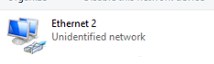
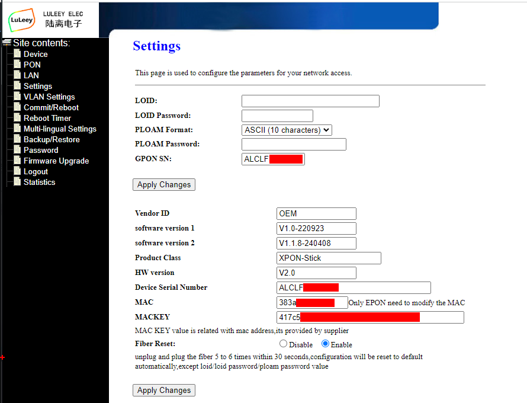
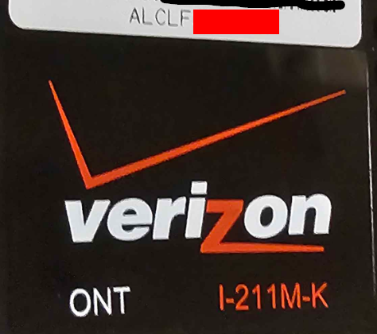
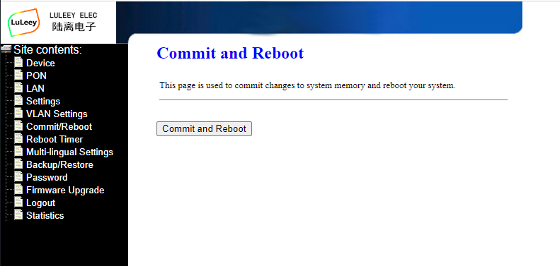
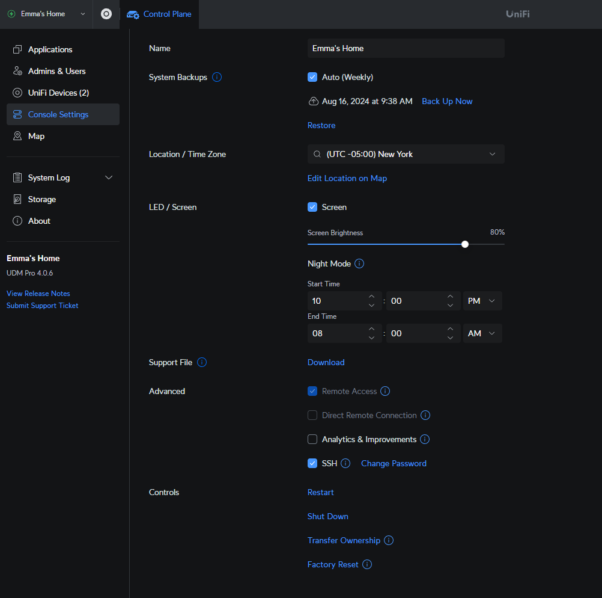
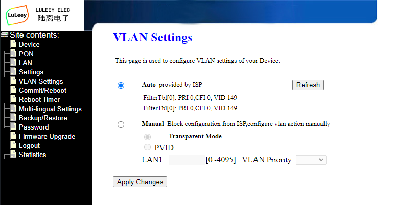
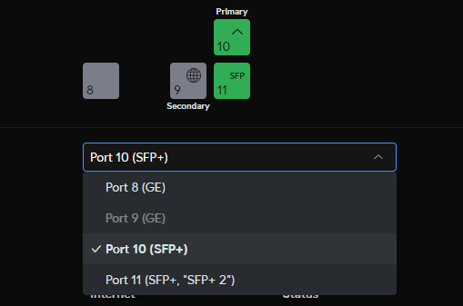
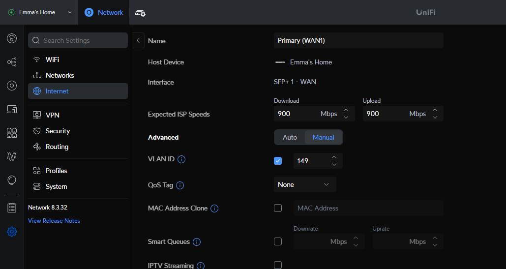

# Setup
[Unifi UDM Pro using Iszo APC XPON UNO on Verizon FiOS GPON](https://www.amazon.com/iszo-Support-Modify-Network-Converter/dp/B0BZPZNKJ6) 


> [!IMPORTANT]
> It is a 50/50 chance amazon will send you a SC/APC or SC/UPC Iszo ONU. (For verizon FiOS you want SC/APC)
> 
> You can tell if the ONU is SC/APC if the little handle on the ONU is Green. If it is Blue your ONU is SC/UPC.
> 
> Both units will work, but if you have a SC/UPC (blue) ONU you will need an adapter [Link](https://www.amazon.com/dp/B0B51TKMMK?ref=ppx_yo2ov_dt_b_fed_asin_title)

Verizon ONT: I-211M-K

ISZO ONU: LL-XS2510


> I used [this](https://hack-gpon.org/ont-odi-realtek-dfp-34x-2c2/) as reference

For programming I used a PCIE Mellanox ConnectX-2 but any media converter or compatible switch should work fine. 

# ONU Setup
- I started out by plugging in the UNO into my connectx-2 for programming. I manually set the NIC to 192.168.1.10/24 leaving the gateway section blank.


- You will know when the UNO is up and running when NIC shows a status of “Unidentified Network”. If the UNO does not come up within 5 minutes, you can try disabling and re-enabling the NIC.



- Once the UNO is up, Navigate to the Web UI at 192.168.1.1
    - Username: admin Password: admin
- Go to the “Settings” tab
- Enter your SN in the “GPON SN” and “Device Serial Number” field.



- My SN was found on the front of my Verizon provided ONT
   - Mine started with “ALCLF”



- Leave “LOID”, “LOID Password” and “PLOAM Password” Blank. If there is something in the field clear it out.

> [!IMPORTANT]
> Now press BOTH “Apply Changes” on the page.

- Open Putty and SSH into the ONU at 192.168.1.1
- Log in with the same Username and Password and run this command.
```
flash set OMCI_FAKE_OK 1
```
- You can now exit putty.
- Going back to the GUI. Go to the “Commit/Reboot” tab and press “Commit and Reboot”

- Give the ONU a few minutes.
# UDM Pro Setup
### Setting Up SSH
- You can now remove the ONU from the Media converter, Connectx-2 or switch and plug the ONU into the UDM PRO.
    - For this next step we need to enable SSH on the UDM PRO



- Under the ”Control Plane” tab in Unifi, navigate to ”Console Settings”
Enable SSH under “Advanced” it will ask you to set a password.
- Now open putty and go to the IP address of the UDM PRO (Your gateway IP)
    - Username: root 
    - Password is the password you set in settings.

- You will need to run this command in the UDM PRO console.
    ```
    ip addr add dev eth9 local 192.168.1.100/24
    
    iptables -t nat -A POSTROUTING -o eth9 -d 192.168.1.0/24 -j SNAT --to 192.168.1.100
    ```
### Finding the VLAN
- You may now plug in the fiber.
- Navigate to the 192.168.1.1 address of the ONU.
- Go to the “PON” tab, if your settings are correct, you will see “O5” under the GPON Status.

- Now navigate to the “VLAN Settings” tab
    - Make note of the VID number that you get. This is our VLAN number.



- We need to first set the SFP port of the ONU to “WAN 1” 
    - This is under Settings > Internet 
    - It should be Port 10



- Enter your Unifi controller, Go to Settings > Internet > Wan1 
- Now enter the VLAN number we got in the ONU and save.



- You should now have internet access. Congratulations 😎

> [!NOTE]
> Once you enter the VLAN Number in Unifi you will lose access to the ONU.
> If you need access again, disable the VLAN ID on the wan port and rerun the above UDM PRO command 
